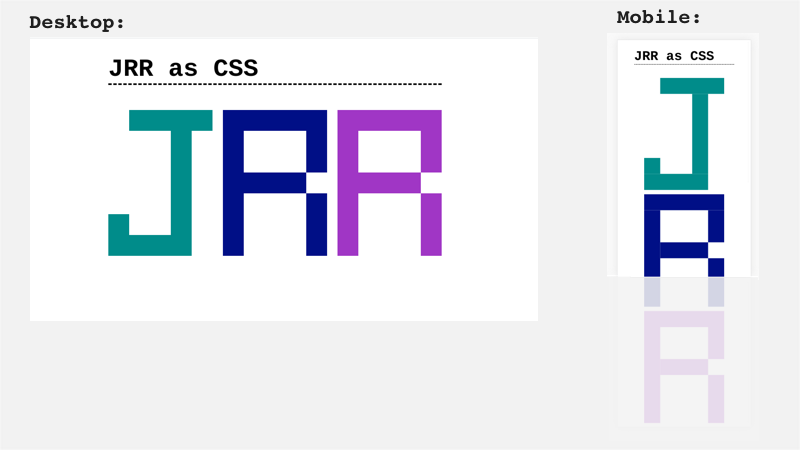

# CSS Monogram

In this mini-project, you'll build a page using HTML and CSS which you'll later add to your first development portfolio.

## Minimum Viable Product (MVP)

Using only HTML `
` elements and CSS code, display your initials in blocky letters.

* Use Flexbox, Grid, positioning, or any combination of the three at your discretion.
* Use a different color of your choice for each letter.
* On desktop screens, show the letters side by side; on mobile screens, show them in a column that users can scroll.
* You may use one `<h1>` tag if you like, but the monogram must be made of colored divs.

### Example

## Post-MVP (Highly recommended!)

Once you have met the expectations above, build additional features as time permits.

Some suggestions:

* [Use `border-radius`](https://developer.mozilla.org/en-US/docs/Web/CSS/border-radius) to round specific corners of each letter.
* Form your letters out of individual circles or spaced blocks.
* [Use `transform`](https://developer.mozilla.org/en-US/docs/Web/CSS/transform) to twist your letters around.
* Try to give your letters a border or a shadow.
* Build your letters from blocks with image backgrounds instead of solid colors.
* Display each letter (or all three!) with a single, unbroken image background.
* Try whatever you can think of! Use only CSS -- no JavaScript or jQuery. (We'll get to that soon!)

## Instructions

1) Fork and clone this repository.
2) Create a new directory called `your-name-monogram` to hold your project files.
3) Create `index.html` and `style.css` to hold your code. (Be sure to add your CSS file using a `<link />` tag in the header of `index.html`!)
4) Produce the result described as 'Minimum Viable Product' above.
5) Commit your code and push changes to your fork.
6) For (optional) post-MVP experimentation, copy your MVP work into an additional folder within your repository called `your-name-experiment` and get wild!
7) Commit and push again.
8) Submit a pull request titled "Your Name - Monogram". Be sure to fill out the information in the pull request template!
